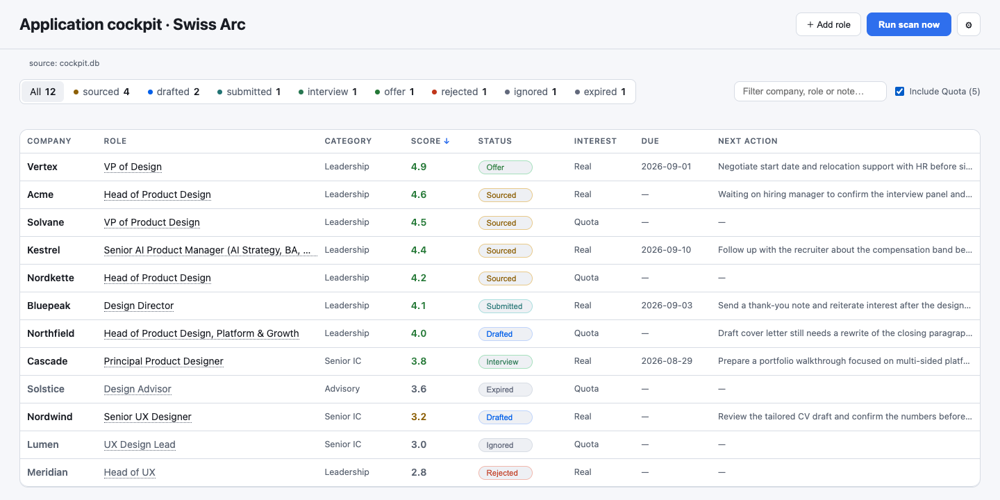
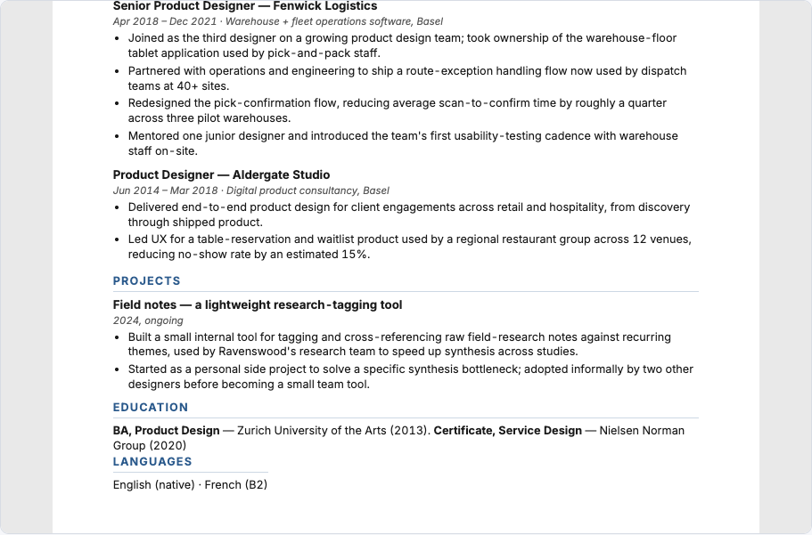
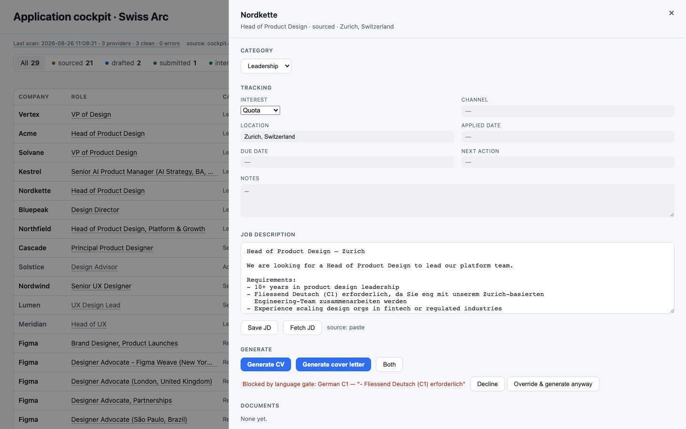
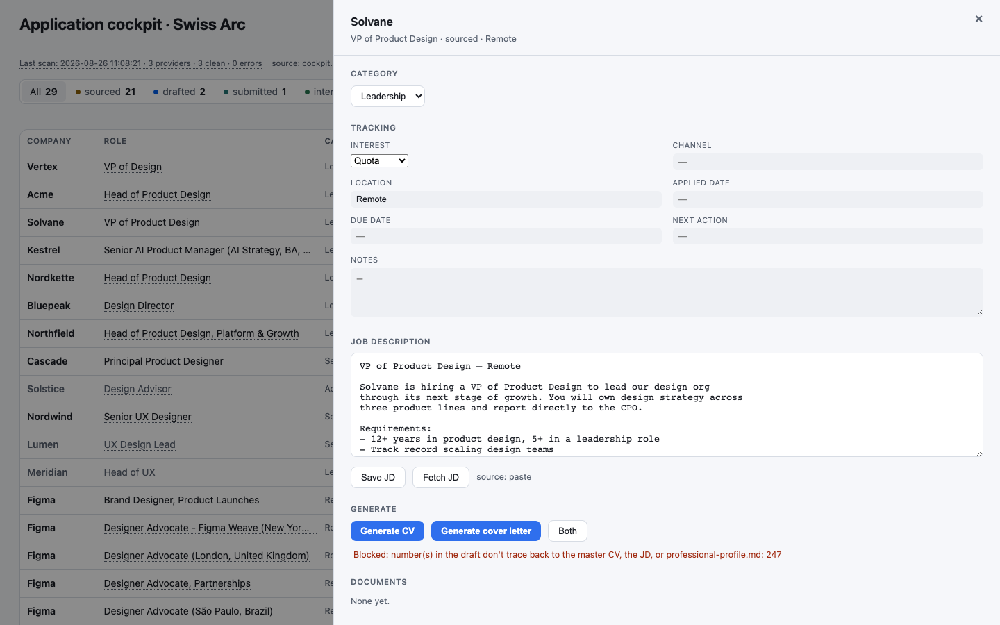
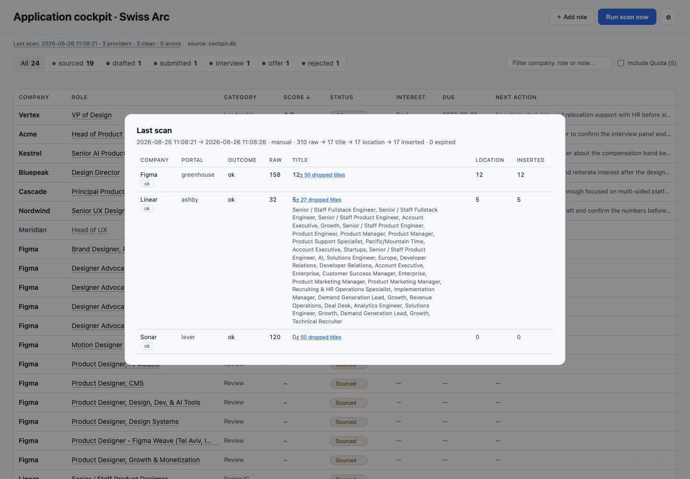

# Application cockpit

A local tool for running a senior job search properly: source roles, screen them before
spending anything, draft a tailored CV and cover letter, verify both against your real
history, and render a PDF that looks designed rather than parsed.

It never submits anything. There is no code path that could.



## Why I built it

I'm a design leader searching for Head of Design roles in Swiss fintech, and the part
that wore me down wasn't writing applications. It was re-explaining myself. Every
tailored CV meant pasting my background, my writing voice, and the job description into
a fresh chat that had forgotten all three, then checking the output line by line for
things I never actually did.

Most tools in this space solve a different problem. They optimise for volume: scrape
widely, score fast, apply often. At senior level that's the wrong shape. Roles I'd
actually take appear a few times a month, not a few times a day, and one application I
can defend in an interview is worth more than fifty I can't. So this optimises for the
opposite thing. Fewer applications, each one checkable.

## How it works

```
SOURCE  ──▶  GATE  ──▶  GENERATE  ──▶  VERIFY  ──▶  RENDER  ──▶  TRACK
```

| Stage | Owner | What it does |
|---|---|---|
| Source | `job_scanner.py`, `staging.py` | Seven ATS providers: Workday, Greenhouse, Lever, Ashby, SmartRecruiters, Workable, Oracle HCM. Which companies, which titles, which locations are all config, not code. Roles found elsewhere — a manual add, or a scheduled task that stages JSON for the ingest panel to apply — arrive through the same duplicate check. |
| Gate | `prompt_assembly.py`, `language_gate.py` | Screens the role before a single token is spent. |
| Generate | `generation.py`, `cv_schema.py` | Your master CV, writing rules and profile stay resident. The model returns structured JSON, not prose, so tailoring can't break the layout. |
| Verify | `verifier.py`, `numeric_fact_gate.py` | Checks the draft against your actual history. |
| Render | `cv_render.py`, `pdf_export.py`, `ats_verify.py` | Jinja to HTML to headless Chrome to a two-page A4 PDF, with the fonts embedded. |
| Track | `db.py` | SQLite. Every scan, every decision, every document version. |



## The part I care about

Every tool I looked at promises it won't auto-submit your applications, and every one of
them enforces that promise with a sentence in a prompt file. A sentence in a prompt file
is a request. A different model, a jailbreak, or a bad day and the promise is gone.

The guarantees here are code. Not better-worded instructions, code that either runs or
doesn't:

**Language gate.** Blocks generation when a posting requires a language you haven't
declared, and quotes the requirement back at you. Warns, without blocking, when you've
declared it below the level asked for. Swiss postings ask for German or French
constantly and the answer is knowable before you spend anything.



**Numeric fact gate.** Every number in a generated draft has to trace back to your master
CV, the job description, or your profile. One that doesn't is a hard block with the
unmatched figures listed. Team sizes and percentages are where interview liability
lives, and a model will invent them politely.



**ATS text-layer gate.** Extracts the rendered PDF's text with `pdftotext` and refuses
the download if the email and phone number aren't in it as literal text, if the reading
order doesn't match the page, or if the extraction is full of `(cid:*)` garbage. A CV
that looks perfect and parses as nothing is a real way to lose applications quietly.

**Category and JD gates.** No mapped CV for the category, or no job description stored,
and generation isn't attempted at all. No API call happens.

The source-fidelity check is deliberately advisory rather than blocking: it flags names
and claims that don't appear in your CV, and you decide. Not everything should be a wall.

## What it doesn't do

No auto-submit, no form filling, no LinkedIn scraping, no aggregator support.

That last one wasn't laziness. I looked at adding Switzerland's two largest job boards
and stopped: their `robots.txt` disallows the API path, their terms of use prohibit
automated access, and a single unauthenticated request came back classified as a bot.
Three signals, one answer. `robots.txt` is checked at request time for Oracle HCM, which
is the newest provider, and not yet for the other six.

## Quickstart

```bash
git clone <your-fork>
cd application-cockpit
python3 -m venv .venv && source .venv/bin/activate
pip install -r requirements.txt
playwright install chromium          # PDF rendering
brew install poppler                 # or: apt install poppler-utils

cp config.yaml.example config.yaml
cp .env.example .env                 # add your ANTHROPIC_API_KEY

python -m pytest                     # 322 passed
python app.py                        # http://127.0.0.1:8766
```

The database creates itself on the first request, however you serve the app. Out of the
box it ships a sample profile, a fictional master CV, and three example companies, so a
first scan returns real postings before you've configured anything. When I ran it while
writing this, three companies returned seventeen matches.

## Making it yours

Everything personal lives in files git ignores. Point `config.yaml` at your own CV,
writing rules and profile, replace the company list and title patterns in the `scanner:`
block, and your data never enters a commit. There's no separate personal build. I run
the same code you do, it just reads different files.

Two things worth knowing before you rely on it. Title patterns are yours to tune, and
the scan report shows you every title it threw away so you can tune them against
evidence rather than guesswork. Mine were written in English and were silently dropping
"Manager, Product UX Design" until I looked. And the master CV is the verifier's ground
truth, which means anything you put in it is treated as fact from then on. Edit it
deliberately.



## Credits and licence

This project came out of the [UX for AI certification](https://uxforai.com/c/certification),
co-hosted by Greg Nudelman and Daria Kempka. The scanner that seeded it was Greg's, given
to me during the course, and published here with his blessing.

MIT, with one exception documented in [CREDITS.md](CREDITS.md): five of the provider
handlers began as that scanner Greg wrote for his own search and gave me directly.
They're still close to what he wrote, and they aren't mine to relicense.

`CREDITS.md` also records what I took from two MIT-licensed projects, and what I only
took the idea of.
